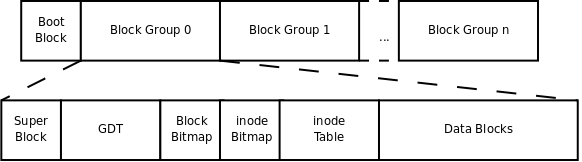

## 文件系统

#### 文件存储

- inode  
    本质为结构体，存储文件的属性信息。如：权限，类型，大小，时间，用户，盘块位置，大多数inode存储在磁盘上，少量常用，近期使用的inode会缓存到内存中  
- dentry  
    目录项，本质也是结构体，重要的成员变量有两个 {文件名; inode; ...}, 而文件内容（data）保存在磁盘盘块中  
```
    inode和dentry间的关系：
        1. 系统通过dentry中的文件名找到该文件inode号
        2. 通过该inode号找到该文件的属性信息（一个结构体）
        3. 结构体里面有一个成员变量存放该文件在硬盘中的位置
```

#### 文件系统

一组规则，规定对文件的存储及读取的一般方法，文件系统在磁盘格式化过程中指定  


#### ext2文件系统

```
    super block: 描述整个分区的文件系统的系统信息，例如块大小，文件系统版本号，上次mount的时间等，占用一个block（4k）
    GDT（group description table）:  记录整个分区所有的块组描述符，每一个块组描述符存储一个块组的信息
```
